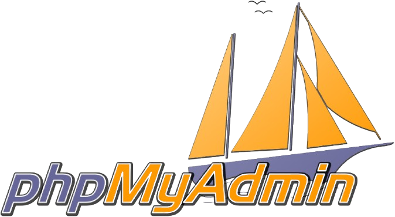

# README.md

# Enchanté 👋 je suis Loris !

### 👨‍💻 À Propos de Moi

Je m'appelle Loris Cavard, j'ai 18 ans et je suis actuellement en première année de Bachelor developpeur FullStack à l'école Coda à Orléans. Je recherche actuellement une alternance (1 semaine à l'école/ 3 semaines en entreprise) pour ma seconde année de Bachelor, à la rentrée de septembre 2026.

* 🌱 **J'apprends en ce moment** : Le langage PHP.
* 💼 **Je recherche une alternance** : Loiret/Paris .
* ✨ **Mes passions** : Le sport automibile 🏎️, le football ⚽, les actualités politiques 📰.

### 🛠️ Mes Compétences et Outils

Voici les technologies que j'ai étudié pour le moment. 

**Langages :** `Python`, `C`  
**Frontend :** `HTML`, `CSS`  
**Backend :** `PHP`  
**Bases de données :** `phpMyAdmin`, `SQL`  

### 📧 Connectons-nous !

| Plateforme | Lien |
| :--- | :--- |
| **LinkedIn** | www.linkedin.com/in/loris-cavard |
| **Portfolio/Site Web** | https://cavardloris.github.io/portfolio-loris-cavard/ |
